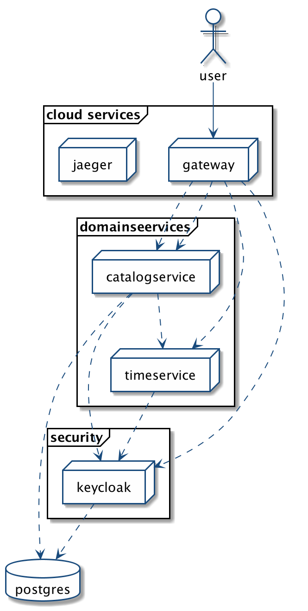

# CloudBay - Cloud Native Performance Tuning Example
## 30/08/20 by Ingo Düppe by [CROWDCODE](https://www.crowdcode.io)

## General Setup

Using Spring Boot 2.3.3 on Java Language Level 8.

## Cloud Infrastructure Services

### **Keycloak** as Identity & Authentication Service

Using docker hub image `jboss/keycloak:latest`.
Service will run locally at `http://localhost:8200` and the username is `admin` and the password is `4d1m!`

### **Mailtrap** as central smtp-service

Creating own docker image based on - eaudeweb/mailtrap
Service will be started under `http://localhost:80` and the default username and password is `mailtrap`.

### **PostgreSQL** as central database

Using docker hub image `postgres:latest`.
Postgres Database is running at default port `5432`.

### **Jaeger** as a distributed tracing sevice

Jaeger Frontend is available under [http://localhost:16686](http://localhost:16686)

## Domain Services

### Time-Service (Resource-Service)

The time-service runs on [http://localhost:8500/now](http://localhost:8500/now)

For this validation to work using the issuer-uri property, the authorization server must be up and running. Otherwise, the resource server wouldn't start.

## Commons

### cloudbay-commons

General helper classes needed by nearby all services.

### service-parent 

CloudBay Spring Boot Parent including some general settings and dependencies.

# Copyright

&copy; Copyright 2020 by CROWDCODE GmbH &amp; Co. KG